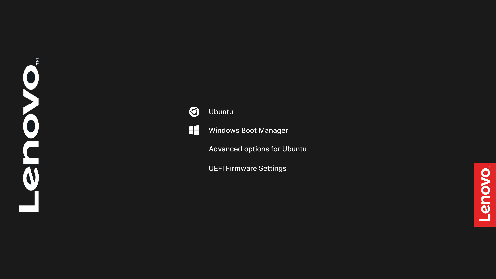
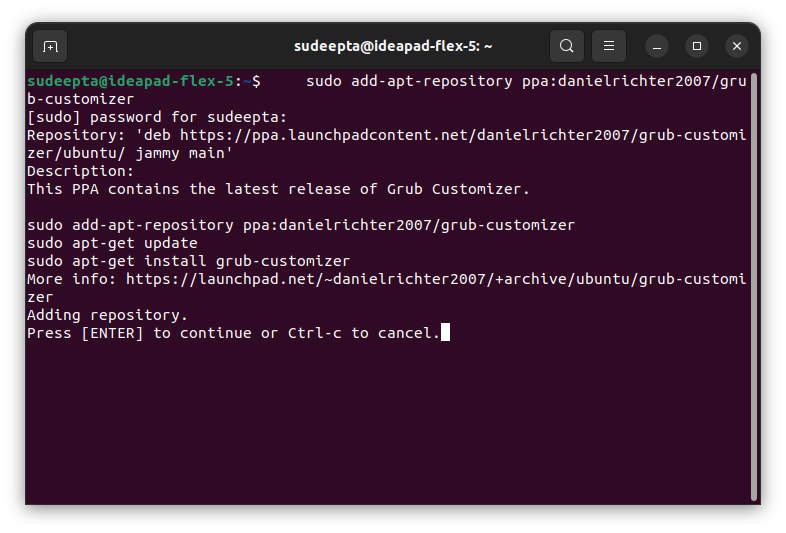
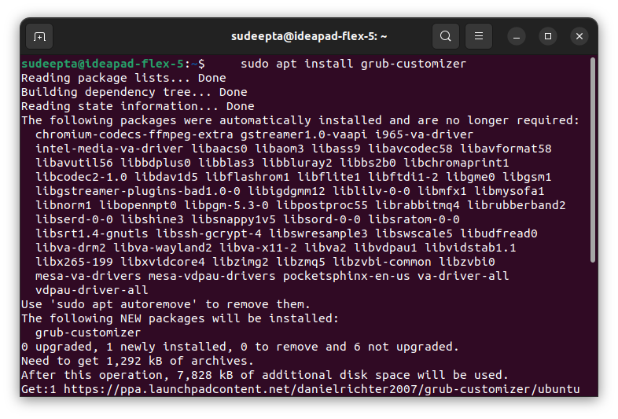
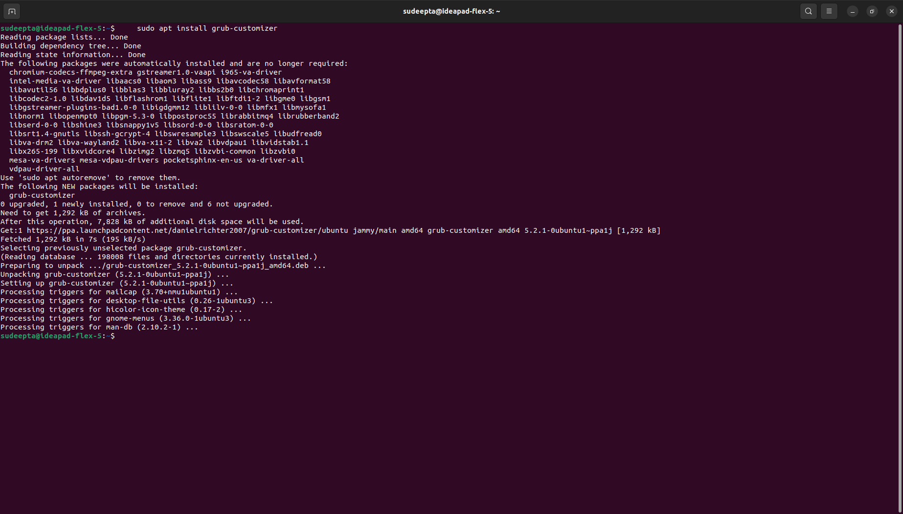
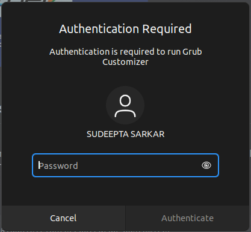
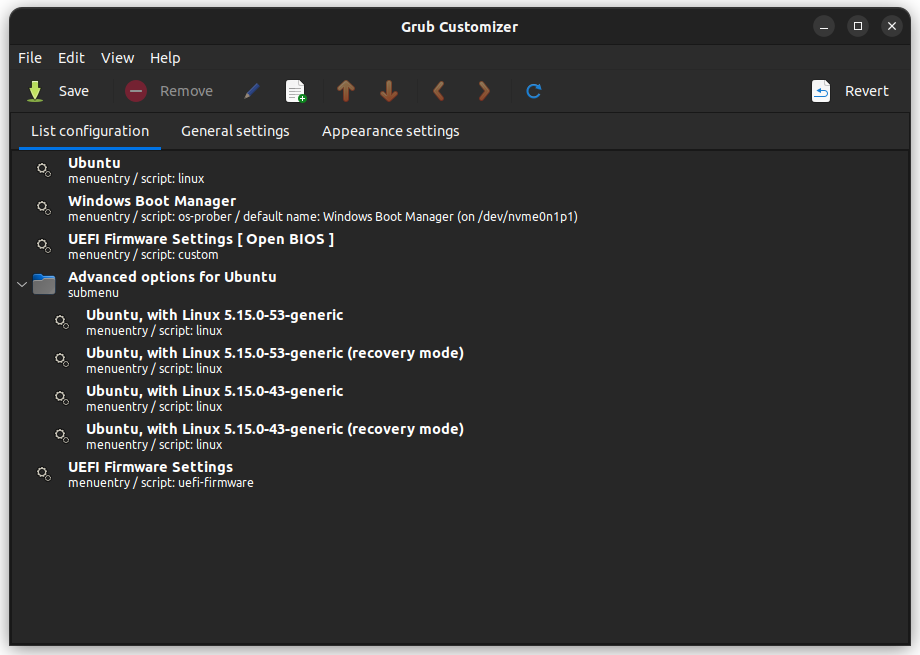

# Lenovo-dark-grub-4k-ubuntu
<head>
<link rel="stylesheet" href="css/PayTm.css">
</head>
<body>
<h3 align="center"><b>PREVIEW IMAGE OF GRUB</b></h3>

 
Grub theme for Lenovo users
 
Grub version 2.0
 
Support me 
<a href="https://paytm.me/v-2r8HG">PayTm: 7809518625</a>
 
 

 
<h2>How to install Grub Customizer</h2>
 

There is an official PPA available from the developer of Grub Customizer. You can use it to install the latest version in any Ubuntu version. Open the terminal with the Ctrl+Alt+T shortcut in Ubuntu.

 

Now use the following command to add the PPA to your system. This way, you’ll get updates on the Grub Customizer application along with the rest of the system updates.

<b>Step-1:</b>

<pre>
    <code>sudo add-apt-repository ppa:danielrichter2007/grub-customizer</code>
</pre>

You’ll be asked to enter your account’s password. Nothing is seen on the screen when you type the password. That’s normal. Press enter when you are asked for confirmation.

<b>Step-2:</b>

<pre>
    <code>sudo apt install grub-customizer</code>
</pre>

And that’s about it. Wait for a few seconds and you’ll have Grub Customizer installed.

 

Open the Grub Customizer application from the app menu(9 dots around the left corner) <b>then</b> search for Grub Customizer.

Since you are indirectly modifying configuration files, you need to have elevated privileges to use this application. You’ll be asked to enter your account password.

 

Once opened, you’ll see an interface similar to this:

 
<h2>How to remove Grub Customizer</h2>
 

Open a terminal and use the following command to remove it:

<b>Step-1:</b>

<pre>
    <code>sudo add-apt-repository ppa:danielrichter2007/grub-customizer</code>
</pre>

If you had added the PPA, you should remove the PPA as well.

<b>Step-2:</b>

<pre>
    <code>sudo apt install grub-customizer</code>
</pre>

And that’s all you need to know about installing and removing Grub Customizer on an Ubuntu.

</body>
